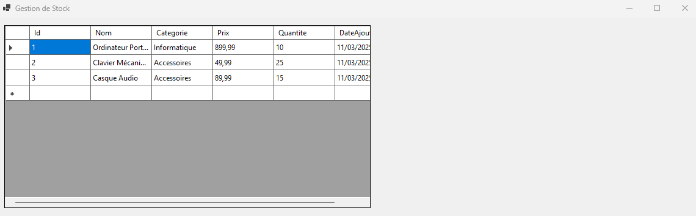

# 📦 Application de Gestion de Stock

## 📝 Description du projet
L'**Application de Gestion de Stock** est une solution logicielle simple permettant de gérer les stocks d'un magasin en utilisant une base de données **MySQL** et une interface graphique développée avec **Windows Forms**.

### 🚀 Fonctionnalités principales
- 🔍 Connexion sécurisée à une base de données MySQL
- 📋 Affichage des produits dans une interface utilisateur avec DataGridView

- ✅ Gestion des erreurs lors de la connexion à la base de données

---

## ⚙️ Technologies utilisées
- **Langage :** C# (.NET)
- **Interface graphique :** Windows Forms
- **Base de données :** MySQL

---

## 📂 Configuration du projet
### 🔧 Installation
1. Clonez le projet en local :
   ```bash
   git clone git@github.com:ugurkaya67/Application-de-Gestion-de-Stock.git
2. Accédez au répertoire du projet :
   ```bash
   cd Application-de-Gestion-de-Stock
3. Installez les dépendances nécessaires :
   ```bash
   dotnet restore
    ```
🖥️ Configuration MySQL\
Assurez-vous que MySQL est installé et en cours d'exécution.

Utilisez les informations suivantes pour votre configuration :

Host : localhost \
Port : 3306 \
Nom de la base de données : StockDB \
Utilisateur : root\
Mot de passe : <votre_mot_de_passe> \
Pour tester la connexion à la base de données, cliquez sur le bouton "Tester la connexion" dans l'application.